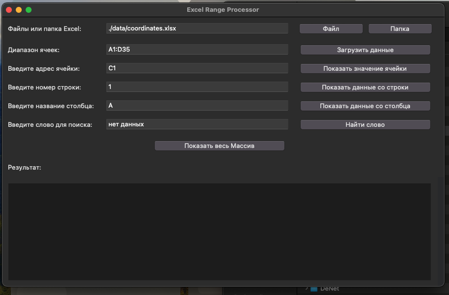

# Решение Тестового задания Обработчик Excel
Выполненные задачи находятся в файлах task1.py, task2.py

## Приложение Обработчик Excel на tkinter
- Загрузка данных из указанного диапазона ячеек в файлах Excel.
- Получение значений из конкретных ячеек.
- Получение целых строк или столбцов.
- Поиск определенных слов в загруженных данных.
- Отображение полного массива загруженных данных.

## Установка
1. Клонируйте репозиторий:
    ```bash
    git clone https://github.com/s1ntecs/excel_parser_tkinter.git
    cd excel_parser_tkinter
    ```

2. Установите необходимые зависимости:
    ```bash
    pip install -r requirements.txt
    ```

## Использование
1. Запустите приложение:
    ```bash
    python main.py
    ```

2. Откроется графический интерфейс, где вы сможете:
    - Выбрать файл Excel или папку с файлами Excel.
    - Указать диапазон ячеек для загрузки (например, `A1:D35`).
    - Просматривать значения конкретных ячеек, строк или столбцов.
    - Искать определенные слова в загруженных данных.
    - Отображать полный массив загруженных данных.

## Компоненты GUI
Графический интерфейс приложения состоит из нескольких разделов:

1. **Выбор файла**:
    - Выберите файл Excel или папку с файлами Excel.
    - Загрузите выбранные файлы для обработки указанного диапазона ячеек.

2. **Ввод диапазона**:
    - Введите диапазон ячеек для загрузки (например, `A1:D35`).
    - Загрузите данные из указанного диапазона.

3. **Операции с ячейками**:
    - Введите адрес ячейки, чтобы получить ее значение.
    - Введите номер строки, чтобы получить все значения в этой строке.
    - Введите букву столбца, чтобы получить все значения в этом столбце.

4. **Поиск**:
    - Введите слово для поиска в загруженных данных.
    - Получите адреса ячеек, содержащих указанное слово.

5. **Результаты**:
    - Отображение результатов операций (значения ячеек, строки/столбцы, результаты поиска, полный массив).
